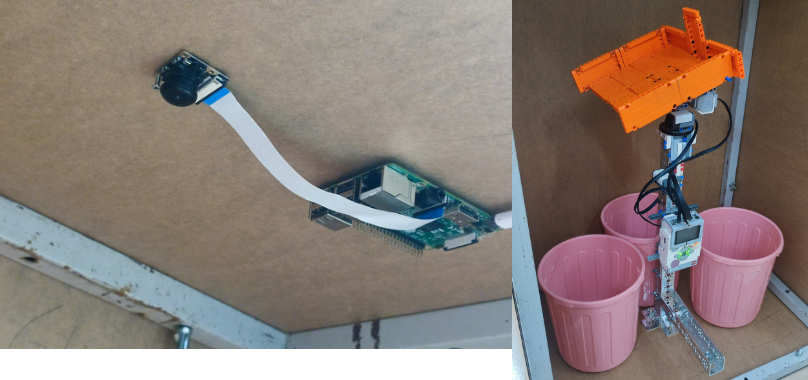

# YOLOv8-3-in-1-Recycle-Bin
This project using Lego Mindstorm EV3 communicate with Raspberry Pi equipped with Rapsberry pi Camera to run the recyclable waste detection using YOLOv8. The project successfully won the Silver Award in the National Robotics Competition State Level Future Innovator Category.

<div align="center">
   
</div>

## Table of Contents
1. [Sofware Used](#Software_Used)
2. [Web Setup](#Web_Setup)
3. [Features](#features)
4. [Documentation](#documentation)
5. [Contributing](#contributing)
6. [License](#license)
7. [Acknowledgments](#acknowledgments)
8. [Website Address](#Website_address)

## Download

### Step 1: Create virtual environment in Anaconda
1. Clone the repository:
   ```python
   

### Step 2: git clone the respiratory
1. Clone the repository:
   ```bash
   git clone https://github.com/WyOoi/YOLOv8-3-in-1-Recycle-Bin.git

## Web_Setup

### Step 1: Create SubDomain
1. Account registration for AwardSpace free web hosting:
[Link text](https://www.awardspace.com/)

## License
[](https://www.gnu.org/licenses/gpl-3.0)

Copyright (C) 2024 WyOoi
-   Licensed under the GNU General Public License v3.0 (the "License").
-   You may not use this project or any file except in compliance with the License.
-   You may obtain a copy of the License at [https://www.gnu.org/licenses/#GPL](https://www.gnu.org/licenses/#GPL).
